# Задание 1: BRIN индексы и bitmap-сканирование

1. Удалите старую базу данных, если есть:
   ```shell
   docker compose down
   ```

2. Поднимите базу данных из src/docker-compose.yml:
   ```shell
   docker compose down && docker compose up -d
   ```

   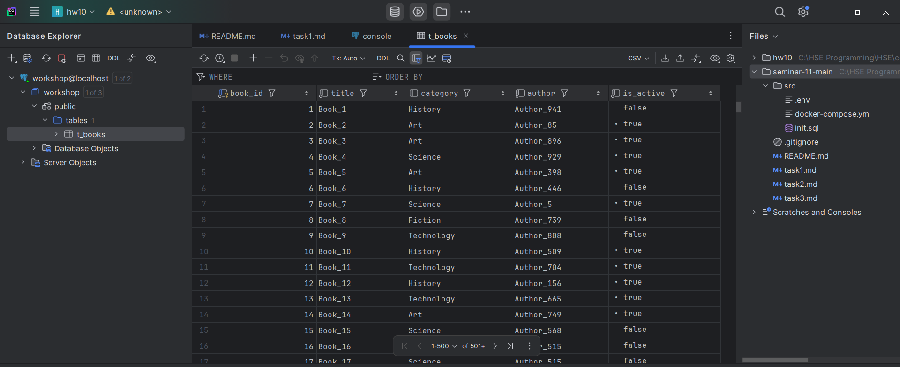

3. Обновите статистику:
   ```sql
   ANALYZE t_books;
   ```
   
   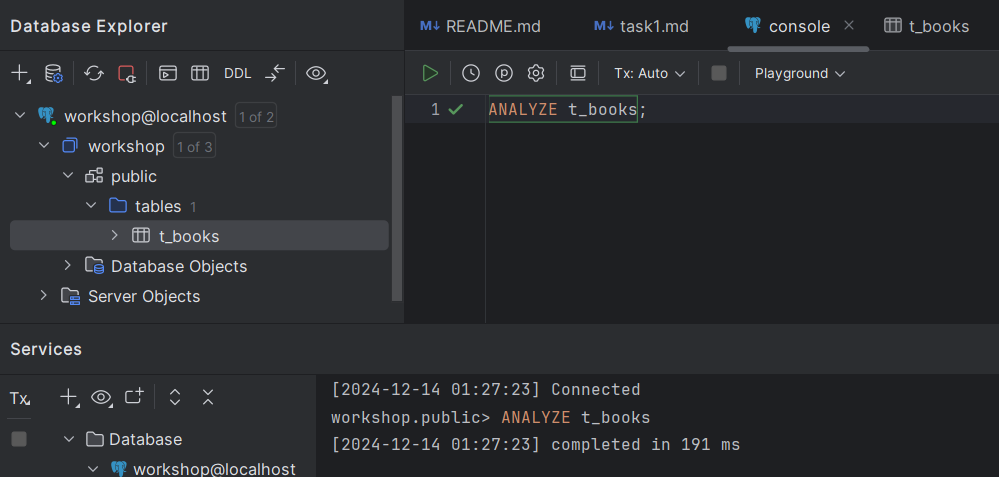


4. Создайте BRIN индекс по колонке category:
   ```sql
   CREATE INDEX t_books_brin_cat_idx ON t_books USING brin(category);
   ```
   
   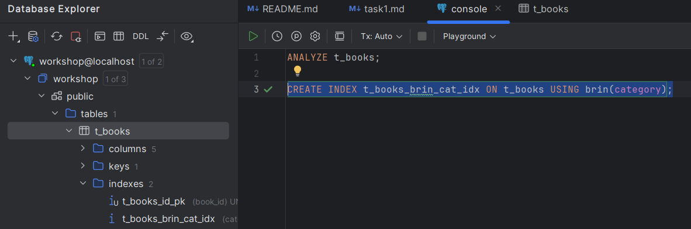

5. Найдите книги с NULL значением category:
   ```sql
   EXPLAIN ANALYZE
   SELECT * FROM t_books WHERE category IS NULL;
   ```
   
   *План выполнения:*
   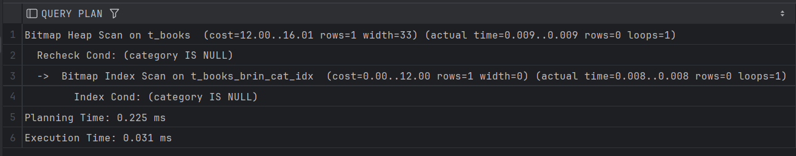
   
   *Объясните результат:*
   
   Сначала у нас произвелось Bitmap Index Scan по BRIN-индексу t_books_brin_cat_idx и мы получили битовую карту

   страниц, на которых может содержаться нужная нам строка. Затем произвелось Bitmap Heap Scan по битовой карте,

   которую мы получили, проверяется соответствие строк условию запроса.

   *rows:*

   Ожидается, что нам вернется одна строка (rows = 1).

   По итогу мы не нашли ни одной подходящей (rows = 0)

   *Planning Time:*

   Время на планирование запроса 0.225 ms.

   *Execution Time:*

   Общее время выполнения запроса 0.031 ms., что достаточно быстро, то есть BRIN-индекс

   достаточно эффективен, потому что таблица большая, а уникальных значений не так много.

6. Создайте BRIN индекс по автору:
   ```sql
   CREATE INDEX t_books_brin_author_idx ON t_books USING brin(author);
   ```

   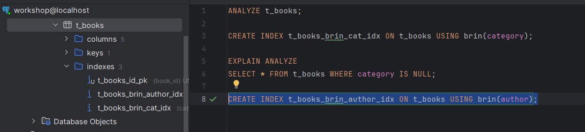

7. Выполните поиск по категории и автору:
   ```sql
   EXPLAIN ANALYZE
   SELECT * FROM t_books 
   WHERE category = 'INDEX' AND author = 'SYSTEM';
   ```
   
   *План выполнения:*
   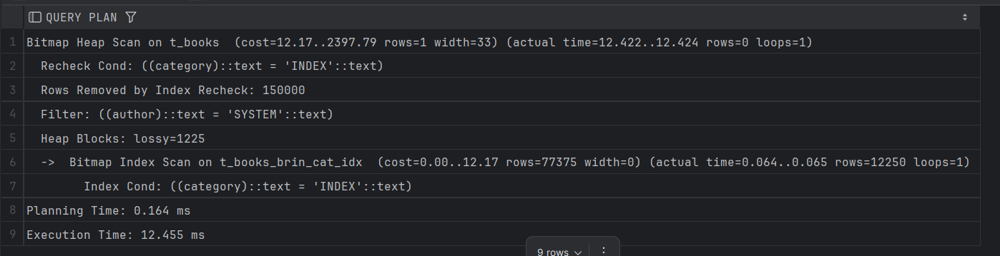
   
   *Объясните результат (обратите внимание на bitmap scan):*
   
   Сначала произвелось Bitmap Index Scan на индексе t_books_brin_cat_idx и время составило ~0.065 ms,

   то есть поиск был достаточно быстрым. При этом примерно 12250 строк могут соответствовать условию запроса.

   После произвелось Bitmap Heap Scan и перепроверялось условие Recheck Cond: ((category)::text = 'INDEX'::text).

   По итогу строк, соответствующих условию не нашлось, было отфильтровано 150000.

   *Planning Time:*

   Время на планирование запроса 0.164 ms.

   *Execution Time:*

   Общее время выполнения запроса 12.455 ms., что не так много для 150000 строк, то есть BRIN-индекс

   достаточно эффективен.

8. Получите список уникальных категорий:
   ```sql
   EXPLAIN ANALYZE
   SELECT DISTINCT category 
   FROM t_books 
   ORDER BY category;
   ```
   
   *План выполнения:*
   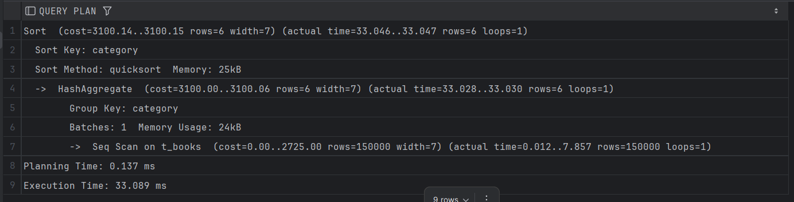
   
   *Объясните результат:*
   
   Сначала у нас выполняется последовательное сканирование, так как нам нужно вытащить все уникальные

   значения категорий.

   Далее у нас использовался HashAggregate чтобы собрать все уникальные значения, полученные после последовательного сканирования.

   На данном этапе было найдено 6 (rows = 6) уникальных значений по category.

   Далее мы сортируем по category с использованием quicksort.

   *Planning Time:*

   Время на планирование запроса 0.137 ms.

   *Execution Time:*

   Общее время выполнения запроса 33.089 ms., что приемлемо для 150000 строк в таблице.

9. Подсчитайте книги, где автор начинается на 'S':
   ```sql
   EXPLAIN ANALYZE
   SELECT COUNT(*) 
   FROM t_books 
   WHERE author LIKE 'S%';
   ```
   
   *План выполнения:*
   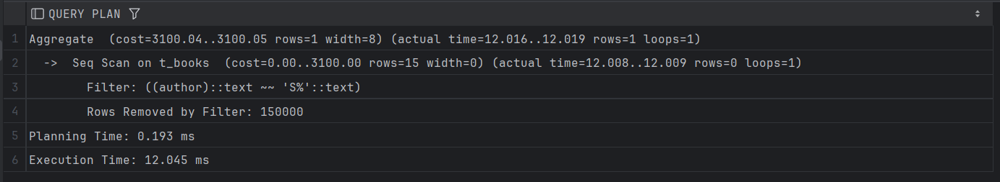
   
   *Объясните результат:*

   У нас использовалось последовательное сканирование, так как наш BRIN-индекс для авторов не подходит

   для использования с LIKE.

   Мы не нашли авторов, начинающихся с 'S' (Rows Removed by Filter: 150000)

   После фильтрации используется Aggregate для подсчета оставшихся после нее строк.

   *Planning Time:*

   Время на планирование запроса 0.193 ms.

   *Execution Time:*

   Общее время выполнения запроса 12.045 ms., что приемлемо для 150000 строк в таблице,

   но можно было бы ускорить, создав подходящий индекс.

10. Создайте индекс для регистронезависимого поиска:
    ```sql
    CREATE INDEX t_books_lower_title_idx ON t_books(LOWER(title));
    ```
    
   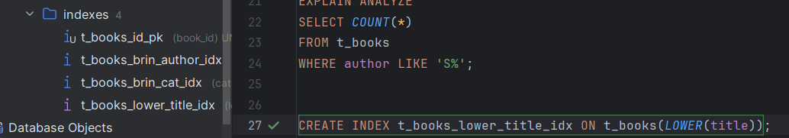

11. Подсчитайте книги, начинающиеся на 'O':
    ```sql
    EXPLAIN ANALYZE
    SELECT COUNT(*) 
    FROM t_books 
    WHERE LOWER(title) LIKE 'o%';
    ```
   
   *План выполнения:*
   
   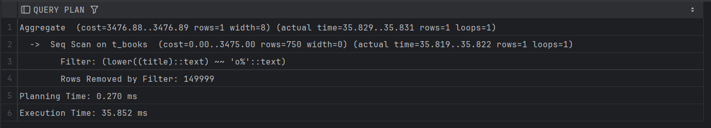
   
   *Объясните результат:*
   
   Сначала выполнилось Seq Scan и проверяется соответствие строк условию.

   Созданный индекс не использовался видимо по причине наличия LIKE и затруднения его использования с LOWER().

   Затем произошла аггрегация к результатам фильтрации и единственная найденная строка при последовательном сканировании

   подошла под наше условие запроса.

   *Planning Time:*

   Время на планирование запроса 0.270 ms.

   *Execution Time:*

   Общее время выполнения запроса 35.852 ms., что достаточно долго.

12. Удалите созданные индексы:
    ```sql
    DROP INDEX t_books_brin_cat_idx;
    DROP INDEX t_books_brin_author_idx;
    DROP INDEX t_books_lower_title_idx;
    ```

   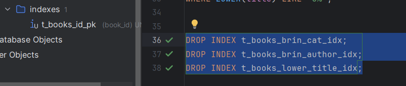

13. Создайте составной BRIN индекс:
    ```sql
    CREATE INDEX t_books_brin_cat_auth_idx ON t_books 
    USING brin(category, author);
    ```
    
   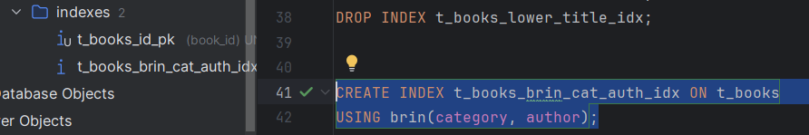

14. Повторите запрос из шага 7:
    ```sql
    EXPLAIN ANALYZE
    SELECT * FROM t_books 
    WHERE category = 'INDEX' AND author = 'SYSTEM';
    ```
   
   *План выполнения:*
   
   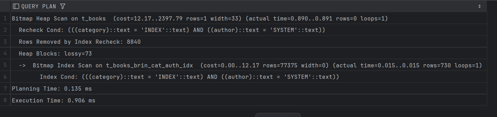
   
   *Объясните результат:*
   
   Здесь у нас уже применился созданный индекс t_books_brin_cat_auth_idx при Bitmap Index Scan, 

   при этом это заняло 0.015 ms., что есть хорошо.

   На этапе Bitmap Index Scan мы отобрали 730 строк, которые могли соответствовать условиям.

   На этапе Bitmap Heap Scan у нас не прошли 8840 строк проверку и мы не нашли ни одной подходящей под условия.

   *Planning Time:*

   Время на планирование запроса 0.135 ms.

   *Execution Time:*

   Общее время выполнения запроса 0.906 ms., что в >10 раз быстрее, чем в пункте 7.

   То есть составной BRIN-индекс показал себя хорошо и эффективно применился.