## Задание 2

1. Удалите старую базу данных, если есть:
    ```shell
    docker compose down
    ```

2. Поднимите базу данных из src/docker-compose.yml:
    ```shell
    docker compose down && docker compose up -d
    ```

    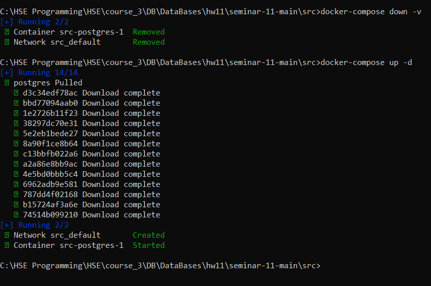

3. Обновите статистику:
    ```sql
    ANALYZE t_books;
    ```
   
    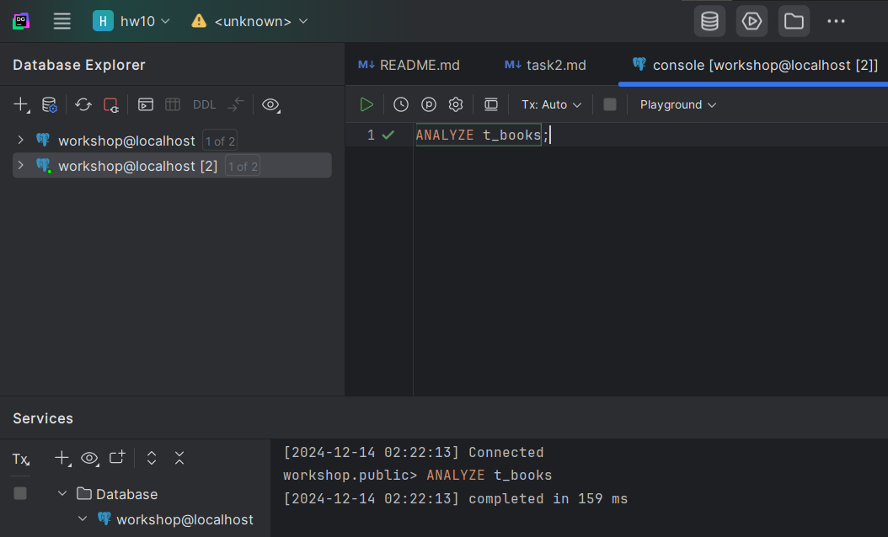

4. Создайте полнотекстовый индекс:
    ```sql
    CREATE INDEX t_books_fts_idx ON t_books 
    USING GIN (to_tsvector('english', title));
    ```

    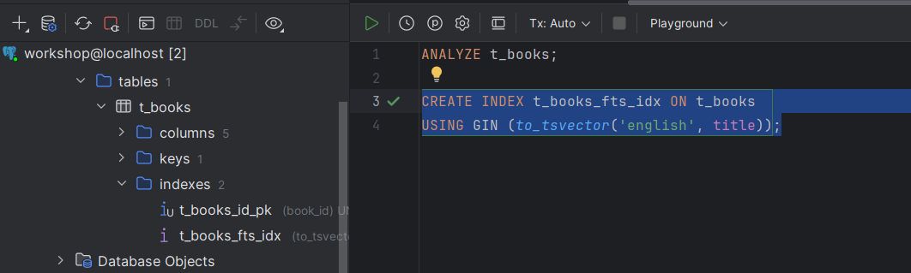

5. Найдите книги, содержащие слово 'expert':
    ```sql
    EXPLAIN ANALYZE
    SELECT * FROM t_books 
    WHERE to_tsvector('english', title) @@ to_tsquery('english', 'expert');
    ```
    
    *План выполнения:*
    
    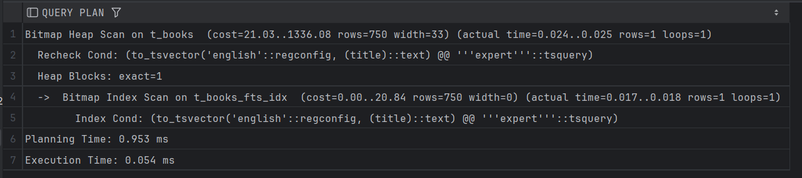
    
    *Объясните результат:*
    
    Сначала произвелось индексное сканирование по t_books_fts_idx и нашлась одна строка, соответствующая условию.

    Это заняло 0.017-0.018 ms., что достаточно быстро.

    Далее использовалось Bitmap Heap Scan, найденная строка подошла под условие.

    *Planning Time:*

   Время на планирование запроса 0.953 ms.

   *Execution Time:*

   Общее время выполнения запроса 0.054 ms., что очень быстро.

    То есть полнотекстовый индекс применился эффективно для поиска по текстовым полям.

6. Удалите индекс:
    ```sql
    DROP INDEX t_books_fts_idx;
    ```

    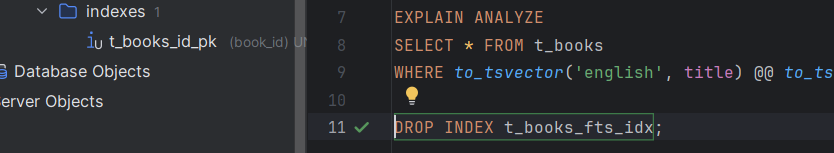

7. Создайте таблицу lookup:
    ```sql
    CREATE TABLE t_lookup (
         item_key VARCHAR(10) NOT NULL,
         item_value VARCHAR(100)
    );
    ```
   
    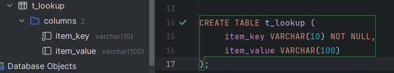

8. Добавьте первичный ключ:
    ```sql
    ALTER TABLE t_lookup 
    ADD CONSTRAINT t_lookup_pk PRIMARY KEY (item_key);
    ```
   
    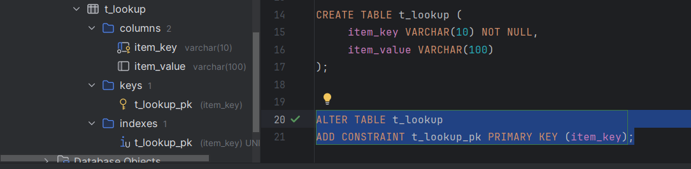

9. Заполните данными:
    ```sql
    INSERT INTO t_lookup 
    SELECT 
         LPAD(CAST(generate_series(1, 150000) AS TEXT), 10, '0'),
         'Value_' || generate_series(1, 150000);
    ```

    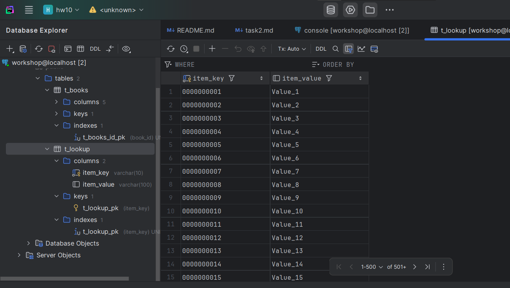

10. Создайте кластеризованную таблицу:
     ```sql
     CREATE TABLE t_lookup_clustered (
          item_key VARCHAR(10) PRIMARY KEY,
          item_value VARCHAR(100)
     );
     ```
    
    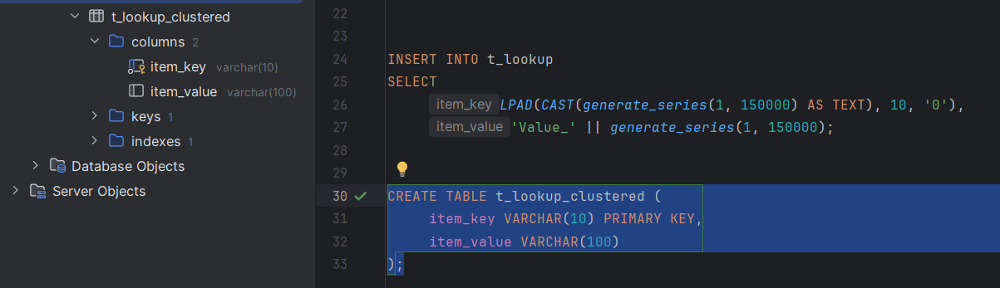

11. Заполните её теми же данными:
     ```sql
     INSERT INTO t_lookup_clustered 
     SELECT * FROM t_lookup;
     
     CLUSTER t_lookup_clustered USING t_lookup_clustered_pkey;
     ```

    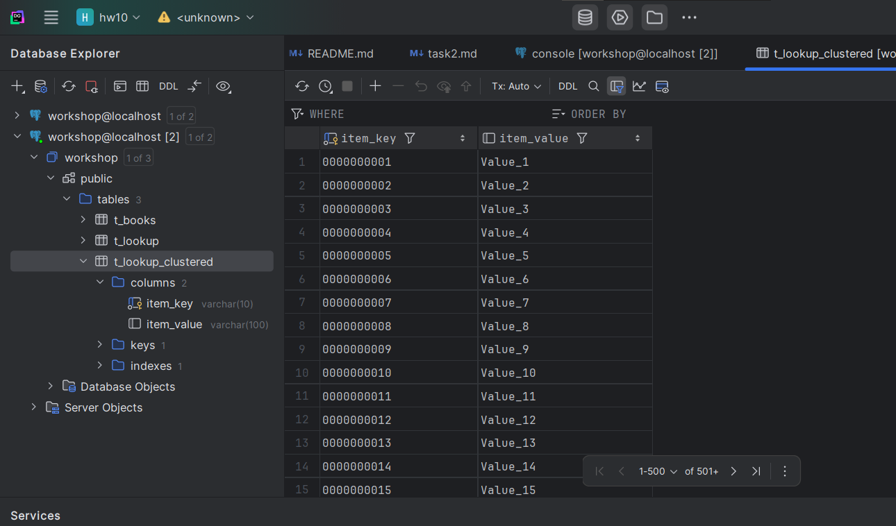

12. Обновите статистику:
     ```sql
     ANALYZE t_lookup;
     ANALYZE t_lookup_clustered;
     ```
    
    

13. Выполните поиск по ключу в обычной таблице:
     ```sql
     EXPLAIN ANALYZE
     SELECT * FROM t_lookup WHERE item_key = '0000000455';
     ```
     
     *План выполнения:*
     
    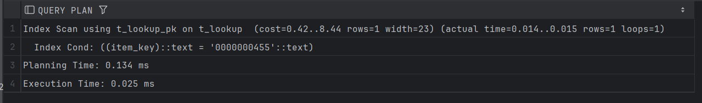
     
     *Объясните результат:*
     
    Использовалось индексное сканирование для быстрого поиска строки с указанным ключом item_key = '0000000455'

    Использовался индекс t_lookup_pk.

    *Planning Time:*

    Время на планирование запроса 0.134 ms.

    *Execution Time:*

    Общее время выполнения запроса 0.025 ms., что очень быстро.

    То есть использование pk очень эффективно при таком запросе.

14. Выполните поиск по ключу в кластеризованной таблице:
     ```sql
     EXPLAIN ANALYZE
     SELECT * FROM t_lookup_clustered WHERE item_key = '0000000455';
     ```
     
     *План выполнения:*
    
     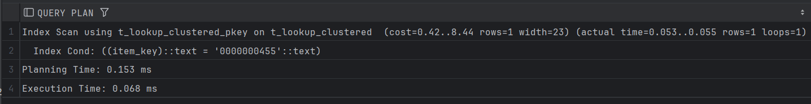
     
     *Объясните результат:*
     
    Использовалось индексное сканирование по t_lookup_clustered_pkey по кластеризованной таблице.

    *Planning Time:*

    Время на планирование запроса 0.153 ms.

    *Execution Time:*

    Общее время выполнения запроса 0.068 ms., что достаточно быстро.

    Несмотря на то, что это медленнее, чем при предыдущем запросе, запрос все равно выполнился быстро.

    Это связано с тем, что мы немного жертвуем в угоду уменьшения количества операций чтения. 

15. Создайте индекс по значению для обычной таблицы:
     ```sql
     CREATE INDEX t_lookup_value_idx ON t_lookup(item_value);
     ```

    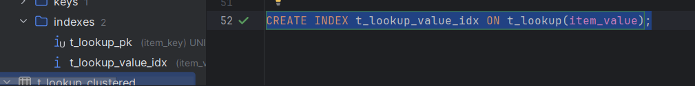

16. Создайте индекс по значению для кластеризованной таблицы:
     ```sql
     CREATE INDEX t_lookup_clustered_value_idx 
     ON t_lookup_clustered(item_value);
     ```

    

17. Выполните поиск по значению в обычной таблице:
     ```sql
     EXPLAIN ANALYZE
     SELECT * FROM t_lookup WHERE item_value = 'T_BOOKS';
     ```
     
     *План выполнения:*
    
     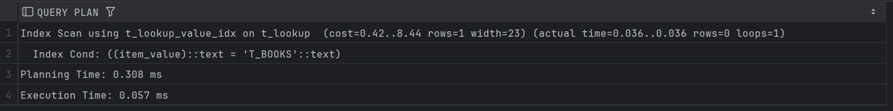
     
     *Объясните результат:*
 
    Использовалось индексное сканирование с t_lookup_value_idx.

    Не было найдено ни одной подходящей строки.

    *Planning Time:*

    Время на планирование запроса 0.308 ms.

    *Execution Time:*

    Общее время выполнения запроса 0.057 ms., что достаточно быстро.

    Запрос выполнился достаточно быстро, индекс использовался эффективно.

18. Выполните поиск по значению в кластеризованной таблице:
     ```sql
     EXPLAIN ANALYZE
     SELECT * FROM t_lookup_clustered WHERE item_value = 'T_BOOKS';
     ```
     
     *План выполнения:*
     
    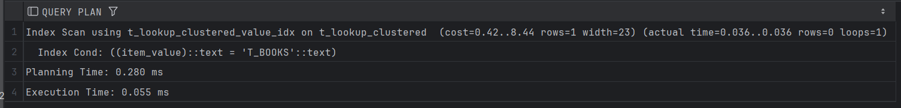
     
     *Объясните результат:*
     
    Произошло индексное сканирование с использованием t_lookup_clustered_value_idx.
    
    Не было найдено строк, которые подходят под условие.

    *Planning Time:*

    Время на планирование запроса 0.280 ms.

    *Execution Time:*

    Общее время выполнения запроса 0.055 ms., что достаточно быстро.

    Таким образом индекс позволяет эффективно находить строки по значению item_value.

19. Сравните производительность поиска по значению в обычной и кластеризованной таблицах:
     
     *Сравнение:*
     
    Мы получили следующее время выполнения:

    - Обычная таблица (t_lookup): 0.057 ms
    
    - Кластеризованная таблица (t_lookup_clustered): 0.055 ms
    
    Разница совсем незначительная.

    Оба запроса использовали индексы и работают достаточно быстро.