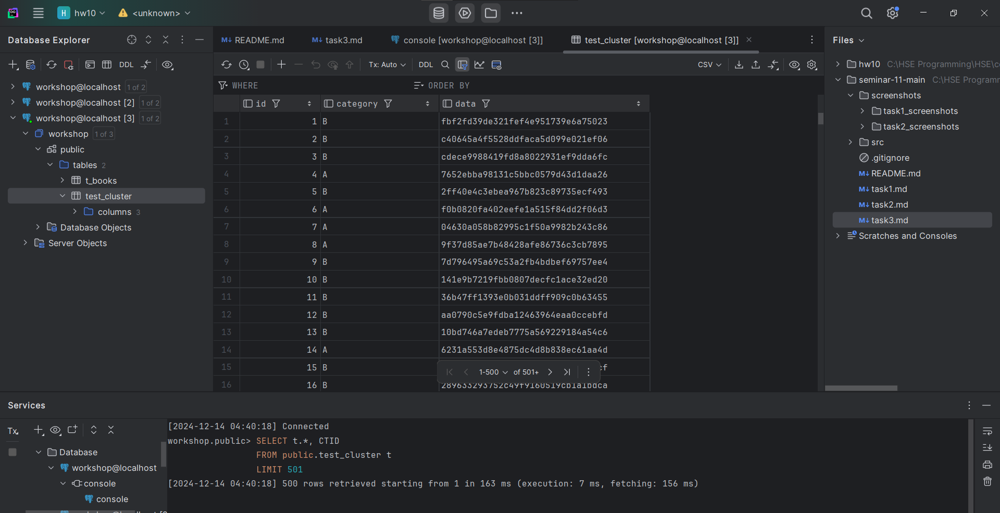
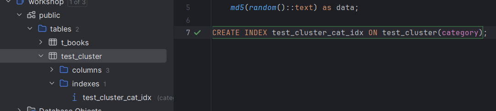
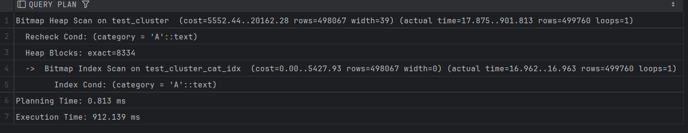
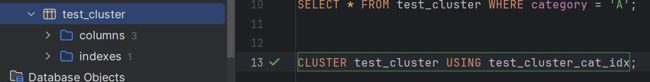
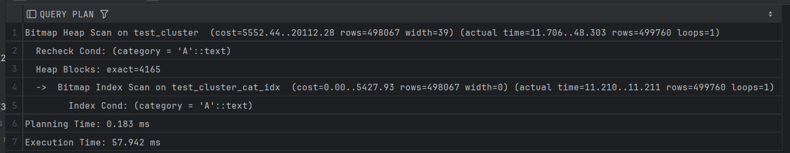

## Задание 3

1. Создайте таблицу с большим количеством данных:
    ```sql
    CREATE TABLE test_cluster AS 
    SELECT 
        generate_series(1,1000000) as id,
        CASE WHEN random() < 0.5 THEN 'A' ELSE 'B' END as category,
        md5(random()::text) as data;
    ```

    

2. Создайте индекс:
    ```sql
    CREATE INDEX test_cluster_cat_idx ON test_cluster(category);
    ```

    

3. Измерьте производительность до кластеризации:
    ```sql
    EXPLAIN ANALYZE
    SELECT * FROM test_cluster WHERE category = 'A';
    ```
    
    *План выполнения:*
    
    
    
    *Объясните результат:*
    
    Сначала используется Bitmap Index Scan с использованием индекса test_cluster_cat_idx.

    Затем используется Bitmap Heap Scan.

    Всего нашлось 499760 строк с категорией 'A'

    *Planning Time:*

    Время на планирование запроса 0.813 ms.

    *Execution Time:*

    Общее время выполнения запроса 912.139 ms. Это достаточно долго, но у нас и данных очень много.

    Если бы мы не использовали индекс, произошло бы Seq Scan.

    То есть индексы эффективно используются и ускоряют запрос.

4. Выполните кластеризацию:
    ```sql
    CLUSTER test_cluster USING test_cluster_cat_idx;
    ```
    
    *Результат:*
    
    

5. Измерьте производительность после кластеризации:
    ```sql
    EXPLAIN ANALYZE
    SELECT * FROM test_cluster WHERE category = 'A';
    ```
    
    *План выполнения:*
    
    
    
    *Объясните результат:*
    
    Происходит все то же самое, что и при предыдущем запросе, но у нас уменьшилось

    почти в два раза количество блоков, которые были извлечены из таблицы (exact = 4165)

    Из-за группирования ввиду кластеризации запрос выполнился в 14+ раз быстрее, не смотря

    на использование того же индекса.

6. Сравните производительность до и после кластеризации:
    
    *Сравнение:*
    
    *Производительность до кластеризации:*

    Время выполнения запроса: 912.139 ms

    Тип сканирования: Bitmap Heap Scan

    Количество извлеченных блоков: 8334 

    Фактическое время индексации: 16.962 ms

    Общее количество строк, соответствующих условию: 499760

    *Производительность после кластеризации:*

    Время выполнения запроса: 57.942 ms

    Тип сканирования: Bitmap Heap Scan

    Количество извлеченных блоков: 4165

    Фактическое время индексации: 11.210 ms

    Общее количество строк, соответствующих условию: 499760

    Таким образом у нас после кластеризации время выполнения сократилось в почти 15 раз,

    количество извлеченных блоков сократилось почти в 2 раза,

    время на индексирование уменьшилось в почти полтора раза,

    то есть для большой таблицы кластеризация показала себя намного эффективнее.